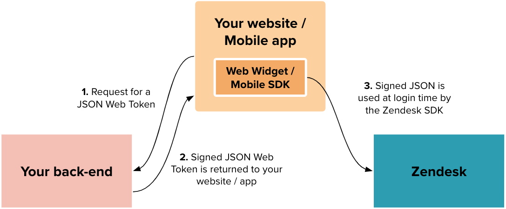
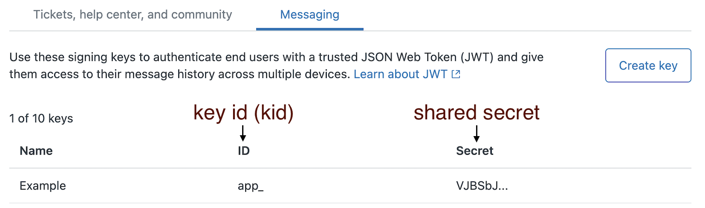
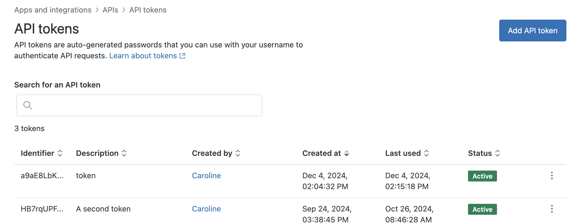
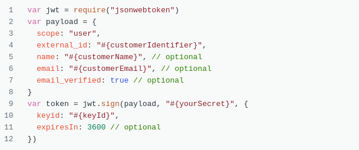
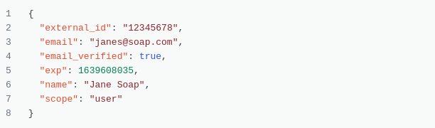
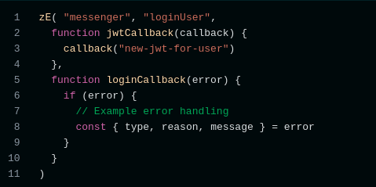
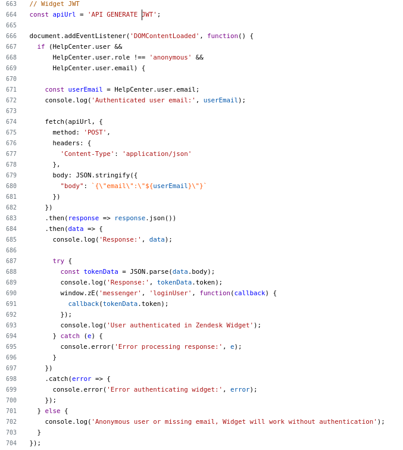
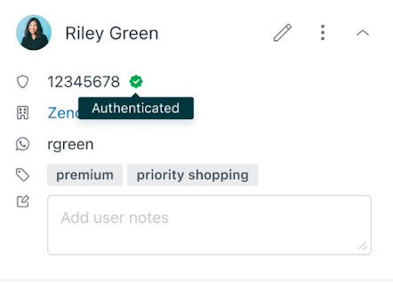

<h1>🔐 Zendesk Messaging User Authentication (JWT)</h1>

This repository provides a simple implementation for generating <strong>JSON Web Tokens (JWT)</strong> to securely authenticate end users in <strong>Zendesk Messaging</strong> across Web Widget, mobile SDKs, or social channels.

<h2>📦 Repository Structure</h2>

This repository has the following folder and file organization:

<pre><code>.
├── docs/
│   └── (assets and screenshots)
├── lib/
│   ├── jwt.mjs             # Handles JWT creation logic
│   └── zendesk-api.mjs     # Handles Zendesk API user lookup by email
├── index.mjs               # Main entry point
└── README.md               # Project documentation
</code></pre>

<h3><code>jwt</code> - JWT Generator</h3>

Responsible for generating the JSON Web Token (<strong>JWT</strong>) required by Zendesk for user authentication. This module follows all the JWT specifications defined by Zendesk and uses the following environment variables:

<ul>
  <li><code>JWT_SECRET</code>: The shared secret provided by Zendesk, used to sign the token.</li>
  <li><code>KEY_ID</code>: The Key ID (<code>kid</code>) of the signing key, also provided by Zendesk.</li>
</ul>

To configure these variables in Zendesk, see <a href="#1--generating-a-signing-key">1. Generating a Signing Key</a>.

<h3><code>zendesk-api</code> - User Data Integration</h3>

Handles the communication with the Zendesk REST API to fetch user data (such as <code>external_id</code>) based on their email address. This is critical for associating the correct user profile when issuing the JWT.

Required environment variables:

<ul>
  <li><code>ZENDESK_API_TOKEN</code>: Your Zendesk API token with read access to users.</li>
  <li><code>ZENDESK_EMAIL</code>: Admin email address (preferably the account owner).</li>
  <li><code>ZENDESK_SUBDOMAIN</code>: The subdomain of your Zendesk instance (e.g., <code>yourcompany</code> for <code>yourcompany.zendesk.com</code>).</li>
</ul>

To configure these variables in Zendesk, see <a href="#2--generating-an-api-token">2. Generating an API Token</a>.

<h2>1. 🔑 Generating a Signing Key</h2>

To authenticate users, Zendesk requires a <strong>signing key</strong>, which includes:

<ul>
  <li><strong>Key ID (kid)</strong></li>
  <li><strong>Shared Secret</strong></li>
</ul>

These credentials are used to sign the JWT sent to Zendesk. Because the secret is only known by you and Zendesk, the platform can trust and verify the JWT, ensuring a secure authentication flow.

You can view, create, or delete signing keys by going to:

<pre><code>Admin Center &gt; Account Settings &gt; Security &gt; End user authentication &gt; Messaging</code></pre>

The <strong>Key ID</strong> and <strong>Shared Secret</strong> may appear with different labels in the UI. Refer to Zendesk’s documentation or UI hints when setting them up.

<h2>2. 🔑 Generating an API Token</h2>

To generate an API token, you must be an <strong>administrator</strong> and have <strong>API token access enabled</strong> in your Zendesk account.

You can view, create, or delete API tokens by navigating to:

<pre><code>Admin Center &gt; Apps and Integrations &gt; API &gt; API Tokens</code></pre>

<!-- Imagen de navegación al token -->

Click <strong>Add API token</strong> and follow the steps. Make sure to <strong>copy the token and store it in a secure location</strong>, because:

<blockquote>
When you click <strong>Save</strong> to close the window, the full token will never be displayed again.
</blockquote>

<h2>3. 🛠️ Creating a JWT for Messaging Token</h2>

JWT for Messaging is used <strong>only</strong> for the Zendesk Web Widget and SDKs. It is <strong>not</strong> the same as the Support SDK JWT or Zendesk Support SSO JWT.

To create a JWT for Messaging:

<h3>🔧 JWT Header</h3>

Create your JWT header with the following fields:

<ul>
  <li><strong>alg</strong>: (required) The signing algorithm. Use <code>HS256</code> (HMAC SHA 256). <em>Note: RS256 and ES256 are not supported by Zendesk.</em></li>
  <li><strong>typ</strong>: (required) The token type. Use <code>JWT</code>.</li>
  <li><strong>kid</strong>: (required) The key ID of the signing key provided by Zendesk.</li>
</ul>

<h3>📦 JWT Payload</h3>

Construct the server-side payload with the following fields:

<ul>
  <li><strong>scope</strong>: (required) Only the value <code>user</code> is supported.</li>
  <li><strong>external_id</strong>: (required, max 255 chars) Unique ID assigned to the user in your system.</li>
  <li><strong>exp</strong>: (optional) Expiration timestamp in seconds. Use a short time for security.</li>
  <li><strong>name</strong>: (optional) Full name of the user. Recommended for Agent Workspace visibility.</li>
  <li><strong>email</strong>: (optional) Email address of the user.</li>
  <li><strong>email_verified</strong>: (optional) Boolean indicating if the email is verified. If <code>false</code>, email will not be used to identify the user.</li>
</ul>

<strong>Example payload structure:</strong>

<!-- Imagen del payload -->

<h3>💻 JavaScript Example</h3>

Here's a code snippet showing how to create the token using a shared secret:

<!-- Imagen del código -->

<h2>4. 💬 Web Widget and Mobile SDK Experience with Authenticated Visitors</h2>

The messaging Web Widget allows authentication of users so their identity can be verified by agents in Zendesk.

<strong>Example experience:</strong>

<!-- Imagen de ejemplo de experiencia del widget -->

<h3>📥 Authenticating in the Web Widget</h3>

Use the <code>new-jwt-for-user</code> generated from the previous step to authenticate the visitor.
Here's an example of how to implement it inside a Zendesk Guide Help Center:

<!-- Imagen del código de integración en Zendesk -->

<h3>👁️ Agent Visibility</h3>

Agents can tell a visitor is authenticated by the check mark icon next to the visitor's name. The <code>external_id</code> also appears next to the user's profile in the Agent Workspace.

<!-- Imagen de la vista de agente -->

<h3>📚 Reference Documentation</h3>

<ol>
  <li><a href="https://support.zendesk.com/hc/en-us/articles/4411666638746-Setting-up-user-authentication-for-messaging" target="_blank">Setting up user authentication for messaging</a></li>
  <li><a href="https://developer.zendesk.com/documentation/conversations/messaging-platform/users/authenticating-users/" target="_blank">Authenticating users - Zendesk Developer Docs</a></li>
  <li><a href="https://developer.zendesk.com/api-reference/widget-messaging/web/authentication/" target="_blank">Widget Messaging Authentication API</a></li>
</ol>

